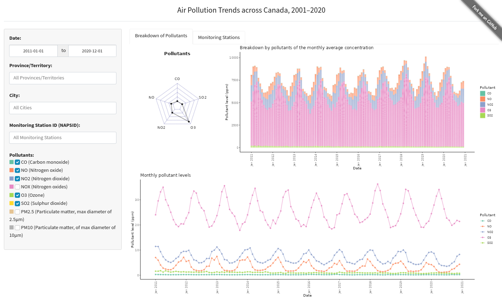

## Introduction

Air pollution is an escalating concern that significantly impacts the health and overall quality of life for Canadians. The levels of various air pollutants are continuously monitored across Canada through the National Air Pollution Surveillance (NAPS) Program. However, one notable challenge lies in the accessibility of this invaluable data to the general public. The NAPS data, though diligently collected on an hourly basis, is often stored in complex data files, making it less accessible and understandable for the average Canadian. To bridge this gap and empower citizens with insights into the changing trends of air pollution in Canada, I together with three other teammates from the Master's in Data Science cohort 2023-2024, developed a user-friendly data visualization app.

## The NAPS Data Visualization App

Our vision was to create an interactive data visualization app that grants all Canadians the ability to explore the NAPS dataset effortlessly. This app will provide a clear and intuitive representation of how air pollution levels, including pollutants like CO2 and NO2, have evolved from 2001 to 2020. Users will have the flexibility to delve into various aspects of this data, selecting specific pollutants and zooming in to explore air quality trends at the provincial and city levels.

## The Interface

The landing page of our app offers a straightforward user interface designed for ease of use. On the left side, users will find drop-down menus that allow them to select a specific province or city within Canada. Additionally, checkboxes enable users to choose the pollutants they are interested in exploring. By default, the options are set to display data for the entire country and all pollutants. These default settings correspond to the following selections:

* Select Province: "All"
* Select City: Inactive
* Select Pollutant: "All"

## Comprehensive Insights

The dashboard within the app goes beyond mere data visualization. It provides definitions of the pollutants under consideration, outlines model assumptions, and offers a concise summary to provide users with a comprehensive understanding of the data. Additionally, we have included attributions and credits for the convenience of our users.

## Access the App

The latest version of the dashboard is deployed on Render as [Air Pollution Dashboard](https://extra.shinyapps.io/air-pollution/). Please be patient as the dashboard may take a moment to load, depending on your internet connection.

## Explore Further

For those interested in the complete details and access to the underlying code, please visit our GitHub repository [Air Pollution Canada GitHub Repository](https://github.com/ranjitprakash1986/Air_Pollution_Canada).

By providing access to this data in a more understandable and user-friendly format, we hope to empower users to make informed decisions.
