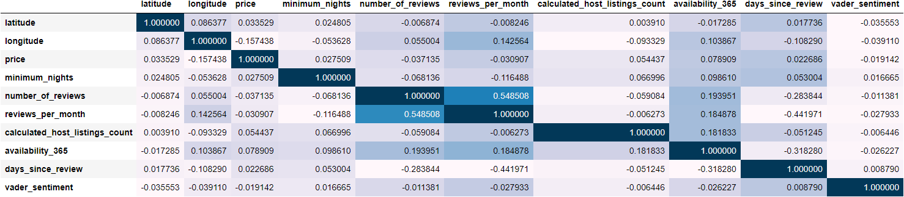
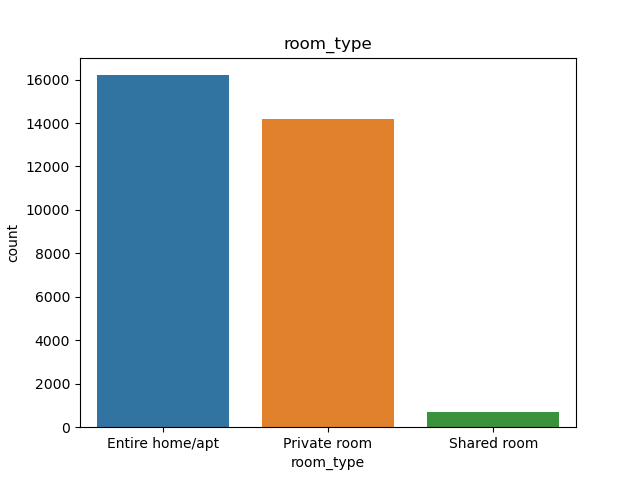
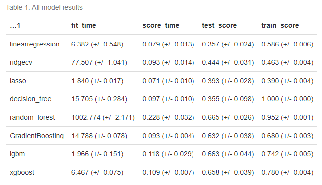

## Summary

In this project I tested multiple Machine Learning models of the data set of NYC Airbnb listings to predict the listing's popularity. The reviews per month column from the data set was used as a proxy indicator of the popularity of the listing. This is a major assumption made to work with the available data on this project. The significance of this project lies in the possibility that with a reliable Machine Learning model, we can determine the parameters that influence popularity of an Airbnb Ad. This can help the Airbnb hosts to write effective Ads. It will help the Airbnb company to work towards increasing the number of hosts that can meet these parameters. Thus Airbnb could use the study to possible improve its business model by focusing attention on selective and promising listings. It will also enable the users/renters to have a more positive experience in using Airbnb.

I found the best performing Model to be the ensemble model **LGBM (Light Gradient Boosted Machine)**. It achieved an **R2 score of 0.68** on the test (unseen) data. This metric ranges from 0 (random model) to 1 (perfect model). Thus our model performs reasonably well and there is scope for further improvment.

**Key inferences**: To increase popularity, Airbnb could look into promoting hosts :- a. who are available for more days during the year. b. who allow larger number of subsequent nights for booking.

## Data

The data set used in this project contains parameters regarding the Airbnb listings in the NYC area collected from 2019. These include attributes of the host such as their host_id, host_name, calculated_host_listings_count, geographical attributes such as latitude and longitude of location, neighbourhood etc. as well as ad attributes such as room_type, price, minimum_nights, number_of_reviews and so on. It was sourced from [here](https://www.kaggle.com/datasets/dgomonov/new-york-city-airbnb-open-data) on Kaggle. Each row in the data set represents the attributes of a specific ad listing in the NYC area.

A correlation plot was made on the finalized features to get some insights into the features that are most linearly related to the target variable. We have to remember that Pearsons correlation depicted here is only an indicator of linear relationship and tells us nothing about possible non linear relationships.

The barplots of the categorical features shows the imbalance in distribution between the different categories.

## Analysis

Sentiment Analysis was performed on the reviews to generate new features. The features were scaled, transformed and split into train and test data. The train data set was used for training, cross validation and model selection. The test data was used to finally assess the performance of the best model discovered. The relationship between the features and the target variable reviews_per_month is inherently non-linear. This intuition was investigated by using linear models such as RidgeCV, Lasso and LinearRegressor. The analysis progresses to next stage with the usage of Decision Trees, Random Forests and Ensemble models. The ensemble models experimented with include, Gradient Boosting, LGBM and XGBoost. Hyperparameter tuning was performed for the best performing model.

## Results

The linear models did not perform well as per the initial intuition. The R-squared score for the best performing linear model was 0.444 (+/- 0.031) for inline modelname. The non-linear models performed much better than the linear models. The Decision Tree model is overfitting with a perfect train score of 1.000 (+/- 0.000) and a poor validation score of 0.355 (+/- 0.098). The Random forest model performed well however it still suffered from overfitting with a train_score of 0.952 (+/- 0.001). Gradient Boosting Maching model adds base learners sequentially to progressively reduce errors in the model. It performed well and the train and validation scores have low difference. The overall validation score is a decent 0.632 (+/- 0.038). Light Gradient Boosting Machine (LGBM) is a faster implementation of Gradient Boosting. This is evident from the dramatically smaller fit time 1.966 (+/- 0.151) as compared to 14.788 (+/- 0.078) for Gradient Boosting. The performance is also better with a validation score of 0.663 (+/- 0.044). XGBoost is extreme Gradient Boosting which is computationally faster and gives a better performance. In this project we see that it’s fit time lies between that of Gradient Boosting and LGBM with a value of 6.467 (+/- 0.075). The performance is good at 0.658 (+/- 0.039). The entire table can be seen below to compare the metrics.

The model performance based on R-squared metric was taken in consideration along with the fit time for selection of the best model. In business application it is often preferred to reduce computation time. This aspect of model preference drew us towards selecting LGBM as the preferred model. The LBGM model was tuned with the above hyperparameters. The Root Mean Squared Error (RMSE) on the unseen test data of the best LGBM model is 0.95 while that on the training data is 0.59. A better gauge of the model performance can be obtained from the R-squared score of 0.68 on the test data as compared to 0.88 on the training data.

## Recommendations

The feature days_since_last_review and number_of_reviews are significant, however they are not actionable from a business perspective.
The minimum_nights and availability_365 are features that could tangibly improve the popularity of a listing based on our inference. Thus Airbnb could look into promoting hosts who are available for more days during the year and also those that allow larger number of nights for booking.
