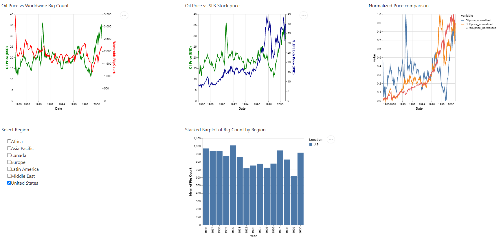

## Summary

The Oildex Dashboard project aims to offer executives and investors a tool for gaining a comprehensive overview of the Oil market within specific selected year ranges. Beyond being a data visualization tool, this platform provides valuable insights into Oil price trends while facilitating comparisons with Schlumberger (SLB) and the S&P 500 stock prices. For a comprehensive understanding of the project's motivation and a detailed description of the data, please refer to the [proposal](https://github.com/ranjitprakash1986/Oildex/blob/main/docs/proposal.md).

### Overview

At the core of the Oildex Dashboard is an intuitive user interface, featuring widgets that allow users to select their desired year range, spanning from 1986 to 2022. This interactive feature serves as a filter, influencing the line plots displayed below. The line plots show the movement of Oil prices in correlation with changes in drilling activity, represented by the Rig Count. Additionally, the dashboard includes a line plot that compares Oil price trends with SLB stock prices. To facilitate a meaningful comparison despite the differing scales of prices, a third plot displays the normalized prices of Oil, SLB stock, and the S&P 500 stock index.

## Exploring Rig Counts

The dashboard's lower section presents a stacked bar plot that provides deeper insights into Rig Counts, categorized by regions of interest. It's important to note that the region selection exclusively influences the stacked bar plot and does not impact the line plots above.

## Access the Dashboard

The latest iteration of the Oildex Dashboard is now accessible on Render, offering a seamless and user-friendly experience. Visit the [dashboard](https://oildex-dash.onrender.com/).

For those interested in delving into the project's intricate details and accessing the underlying code, please visit the GitHub repository: [Oildex](https://github.com/ranjitprakash1986/Oildex).

Please feel free to provide feedback and suggestions.