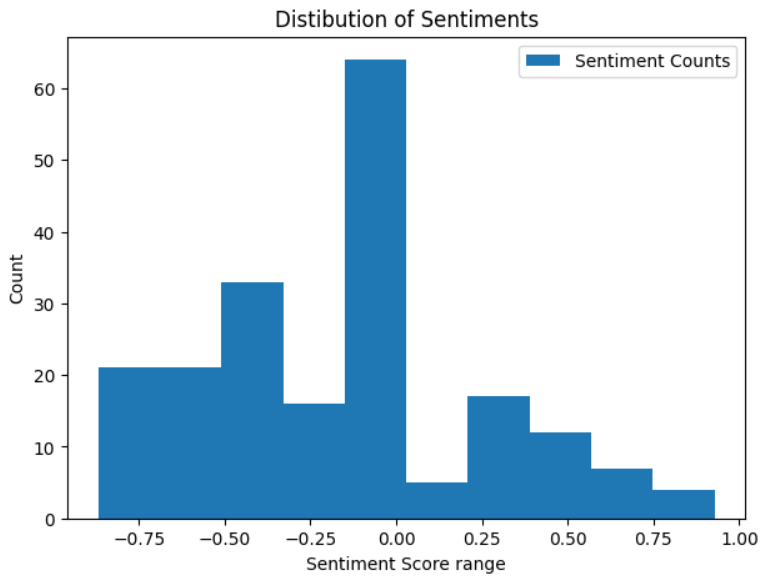
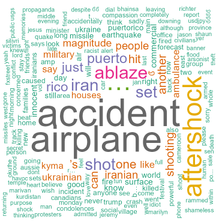

## Motivation

In the realm of data analysis, deciphering written comments from surveys can often be a time-consuming and arduous task. Extracting valuable insights or obtaining a quick summary from a sea of responses can pose a significant challenge. This is where the Sentiment Analysis Package, a project I've been actively involved in, steps in to streamline the process. The primary aim of this package is to swiftly summarize survey responses, providing a concise overview of sentiments within the comments. This tool serves a variety of purposes, from assisting PR teams in gauging the overall sentiment surrounding a company to aiding instructors in understanding the sentiment within a course. The key objective is to offer an easily interpretable summary by combining the capabilities of a pre-trained Python natural language processing package with intuitive visualizations.

## Resulting plots

The Sentiment Analysis Package, is currently configured to perform Vader sentiment analysis and generate a likert scale distribution of survey responses. Additionally, it creates a word cloud that visually represents the common words found within the text. Below are sample plots that showcase the package's capabilities:

For a comprehensive understanding of the project, its functionality, and access to the source code, please visit the respective GitHub repositories:
* [sentimentanalyzerR](https://github.com/ranjitprakash1986/sentimentanalyzerR) 
* [py-sentimentanalyzer](https://github.com/ranjitprakash1986/py-sentimentanalyzer)

The Sentiment Analysis Package represents my goal to simplifying and enhancing the survey analysis process. By automating sentiment analysis and providing clear visualizations, it empowers users to gain valuable insights quickly and efficiently.