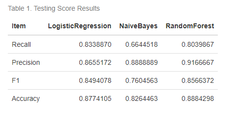
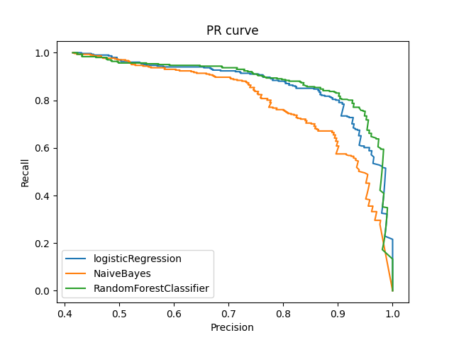
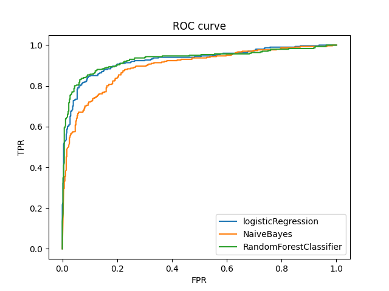
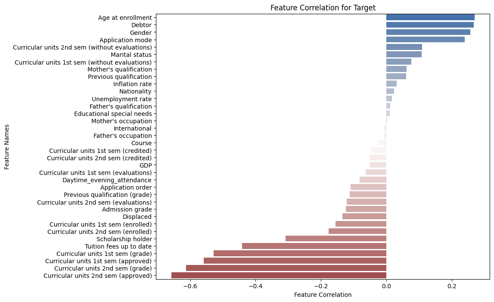

### Introduction

In the realm of academia, the performance and graduation rates of students play a pivotal role in shaping their employability prospects, contributing significantly to overall economic development. This Data Science project revolves around predicting student dropout rates by leveraging a multitude of factors encompassing demography, socioeconomics, macroeconomics, and pertinent academic data, which students provide upon enrollment. The significance of this prediction lies in its potential to shed light on a student's academic journey and capacity. This knowledge serves as a valuable resource, aiding in the identification of key areas for improvement, such as the development of socially disadvantaged communities, enhancement of academic programs, and the creation of educational funding initiatives. My project aims to explore the following research question:

>Given a student with his/her demography, socioeconomics, macroeconomics, and relevant academic data, how accurately can we predict whether he/she will drop out of school?

For comprehensive details, code, and a detailed report, please visit the project's [repository](https://github.com/ranjitprakash1986/dropout_predictions)

### Data

The dataset used in this project encapsulates data collected during students' enrollment and offers a snapshot of their academic performance at the end of the 2nd semester at their respective universities. This dataset encompasses both discrete and continuous data, providing insights into various aspects of a student's life. These encompass macroeconomic indicators such as inflation, GDP, and unemployment rates, as well as personal and family details like gender, previous grades, educational special needs, financial status, parents' education, and parents' occupation. Additionally, it delves into aspects of the educational system, including coursework enrollment, class schedules (day/evening), and scholarship offerings. This dataset, created by Valentim Realinho, Mónica Vieira Martins, Jorge Machado, and Luís Baptista from the Polytechnic Institute of Portalegre, was sourced from the UCI Machine Learning Repository. Each row in the dataset represents the details of an individual student, ensuring there are no duplicate entries.

The original dataset classified students into three categories - Graduate, Enrolled, and Dropout. For the binary classification question addressed in this project, the "Enrolled" class was excluded. Preliminary exploratory data analysis (EDA) revealed 2209 examples of Graduate students and 1421 examples of Dropouts. Consequently, dataset imbalance is not a major concern and can be addressed through balancing techniques.

### Results

The objective of this project is to investigate how accurately we can predict that a student will drop out of school. Furthermore what underlying factors are the predominant influencing this outcome? Accurate classification of a true drop out in the available data is our chosen metric of interest. This is defined as Recall and it represents the proportion of the true drop-outs in the dataset, accurately predicted by the model. Each of the three models Naive Bayes, Logistic Regression and Random Forest Classifier were fitted on training data. The hyperparameter tuning was performed on using Random Search CV for Logistic Regression and Random Forest Classifier. The optimized models were then used to predict the classification on the test data. The performance of the models was compared through the Confusion Matrix, Precision-Recall curve, and Receive-Operating Characteristics plots. The metrics were tabulated for numerical interpretation.

Our train-test split yielded 726 examples in the testing dataset, comprising 425 actual Dropout class instances and the remaining being Graduate. Logistic Regression emerged as the top performer, with the highest True Positives (386) and a superior recall metric of 0.83. Naive Bayes closely followed, achieving 400 True Positives at a recall metric of 0.66. The Random Forest model delivered an appreciable recall metric of 0.8 with 403 True Positives. Overall, the Logistic Regression model recorded the highest recall score (0.83), making it the optimal choice in terms of recall focus (dropout predictions).

The Random Forest Classifier and Logistic Regression models exhibited commendable performance on the F1 score, a balanced measure of model precision and recall. However, Naive Bayes exhibited a relatively lower F1 score, primarily due to lower precision resulting from a higher number of False Positives compared to the other models. The accompanying confusion matrices are shown below for reference.

Furthermore, a correlation analysis between factors and the target objective revealed intriguing insights, such as the higher likelihood of female students with debts dropping out of school.

This project adheres to the rigorous standards set forth by the MDS program for the academic year 2022-2023. Should you have any questions or require further insights, please feel free to connect with me through my social media handles.
