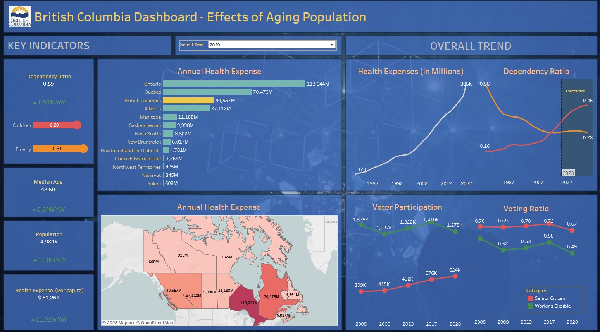

### Introduction

I lived at the core of the city of Vancouver while attending school at UBC. My walks around my neighborhood often made me observe that the general population in the city is senior relative to other cities I have experienced. A quick look at some datasets ascertained my observation. While this might be indicative of an successful healthcare system, I assess that a major concern might loom on the horizon not just for Vancouver, but perhaps the province itself. In this article, I will discuss my analysis of the open source data collected from government websites referenced below. I created an interactive Tableau dashboard that let's you assess the three distinct datasets in a single visual while providing you the flexibility to filter it by the year of interest. Your perceptions might reveal new insights or limitations, please feel free to share it with me. Here I capture the background of the analysis and it's limitations.

### Understanding Dependency Ratio

#### Definition of Dependency
Dependency, in the context of demographics, refers to the state of relying on or being controlled by someone or something else. More precisely, the dependency ratio quantifies the proportion of the dependent population (those who are non-earning) in relation to the independent (earning) population.

### The Significance of Dependency Ratio

#### The Burden of Child Dependents
Among the dependent population, children represent an investment in the future. However, they necessitate substantial expenditures on their upbringing such as education and healthcare, which are essential for the future economy.

#### The Challenge of Elderly Dependents
Conversely, elderly dependents bring wisdom, are a guide for the younger generation, but pose challenges for the future. They require expenditure on healthcare and pension provisions. The  shows a dependency ratio trend of concern: the ratio of elderly dependents is surpasses that of children. By 2041 (forecasted), a staggering 73% of British Columbia's population is projected to be dependent, with 45% being elderly individuals.

### The Economic Impact of an Aging Population

#### Reduced Tax Revenue
This demographic shift brings about a series of economic challenges. One immediate consequence is the reduction in taxes collected by the province due to a diminishing working-age population.

#### Increased Healthcare Costs
Moreover, the aging population will inevitably lead to an increase in healthcare expenditures, putting added pressure on the provincial budget. British Columbia consistently ranks in top three in terms of health expenditure. The Total health expense in 2020 alone was a $40.5 billion, a 12% YoY increase (pandemic effect). It will be interesting to continue to track this trend, as the world has been unpleasantly reminded the importance of a strong healthcare system.

#### Resistance to Change
Another aspect to consider is the potential resistance to change. With a higher proportion of elderly citizens, their influence on political mandates and agendas will grow, as they tend to take a keen interest in political matters. This is evident from their participation ratio in the 2020 provincial elections, a remarkable 67% of registered senior citizens (65+ years) voted, as compared to just 49% of the working class (18 to 65 years).

### Key Takeaways
* Demographic Shift: By 2041, a striking 73% of the population in British Columbia will be dependent, with 45% being elderly (aged 65+ years).
* Healthcare Costs: Per capita public healthcare expenditure in 2020 was nearly $61K and is expected to rise with the increasing elderly dependency ratio.
* Economic Realities: As children are the future of the economy, a decreasing children dependency ratio is foretelling problems.
* Political Influence: The high participation of elders in elections and political matters implies that future government mandates and decisions might increasingly revolve around the interests of the elderly.
* Risk of Resistance: An extension of the previous point, with a growing dominance of the elderly population, there is a risk of aversion to change, potentially hindering the adaptation of new policies and practices to meet evolving societal needs.

In summary, policymakers could consider innovative solutions to sustain the province's economic well-being while ensuring that the interests and needs of all age groups are met. The demographic landscape is changing, and with thoughtful planning, British Columbia can navigate this transformation successfully.

### Limitations:

While the analysis based on year-wise dependency ratios, healthcare expenses, and voter turnout provides some insights into the implications of an aging population in British Columbia, it is essential to acknowledge several limitations. First, these datasets offer a simplified view of a complex and multifaceted issue. They do not capture the nuances of individuals, such as variations in healthcare needs or the socioeconomic diversity within the elderly population.

The analysis assumes a linear relationship between demographic shifts and economic outcomes, which may oversimplify the dynamic nature of these interactions. Demographics alone cannot predict economic behavior accurately. Moreover, voter turnout data, while indicative of political engagement, may not fully reflect the political preferences and priorities of different age groups.

Addressing the complexities of this issue requires a holistic approach that considers qualitative data, stakeholder perspectives, and a nuanced understanding of the societal and economic forces at play.

### Sources:
* 
* 
* 
